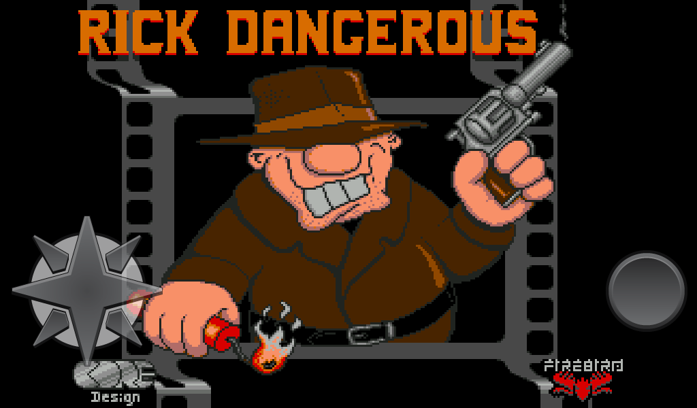
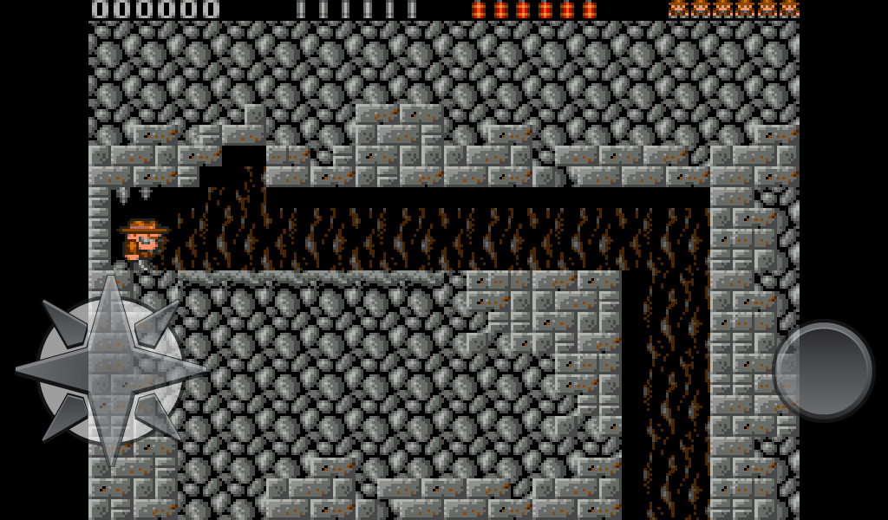
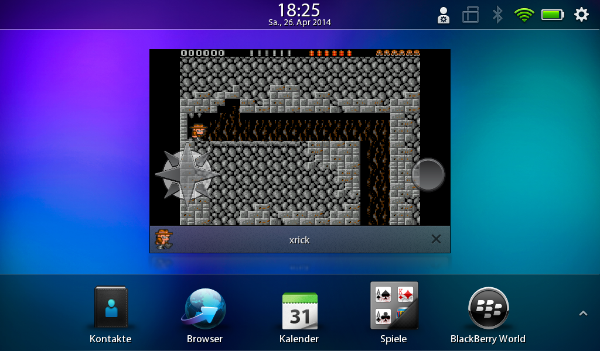

xrick-blackberry
================

A port of xrick (Rick Dangerous rewrite) to the Blackberry Playbook (and later BB OS 10+) 
See the file [README](README) for original readme and [LICENSE.md](LICENSE.md) for license information.

Compiling
---------

You need SDL and TouchControlOverlay, available here:
* https://github.com/blackberry/SDL
* https://github.com/blackberry/TouchControlOverlay

You have to use the IDE currently, instructions and a Makefile follow later.

Playing
-------

Use the D-Pad and Button to control the game:

* Up = Jump
* Down = Crawl
* Left = Go/Jump/Crawl left
* Right = Go/Jump/Crawl right
* Button + Up = Shoot
* Button + Down = Dynamite
* Button + Left = Poke left
* Button + Right = Poke right

Screenshots
-----------

Title screen:

Running the game:

The game pauses when it is not active:

